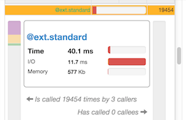
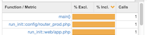
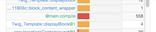
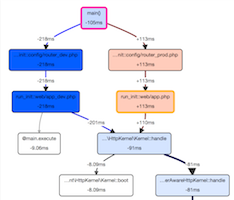
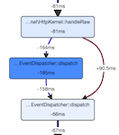

FAQ
===

What are `@ext.*` nodes?
------------------------

For complex applications, profiles can contain tens of thousands of nodes; as
you can imagine, displaying all of them in the interface would be very
expensive and quite a nightmare to reason about. But when trying to optimize
the performance of a code base, a developer is not interested in nodes that are
not significant enough (few calls that consume few resources.) Instead of
ignoring these "small" nodes, they are combined into **aggregate nodes**. Each
`@ext.*` node represents the aggregated costs of nodes of same kind, depending
on the library they belong too. So, all non-significant calls to `strpos()`,
`substr()`, ... are aggregated into `@ext.standard`, regular expression ones
into `@ext.pcre`, and so on. But if a single PHP core function consumes
significant resources, it is not aggregated anymore so that it can be displayed
by itself in the interface.

What is the difference between inclusive and exclusive costs?
-------------------------------------------------------------

In a profile, the code execution is represented as a graph of nodes; so each
node can have parents and children. The **exclusive cost** is the amount of
resources consumed by the node itself, without the costs of its children. The
**inclusive cost** is the sum of the resources consumed by the node itself plus
the costs of all its children (including the children of the children and so
on.)

What do `@compile` / `@run` nodes represent?
--------------------------------------------

Blackfire hooks very early in the PHP engine in the life of a request to be
able to monitor everything PHP does, including compilation and execution
activities.

The `@compile` node is the resources spent to load and compile PHP script files
(when using an accelerator like APC or OPCache, this should be minimal.)

The `@run` node is the resources spent by PHP to execute the opcodes of a
script file; this is the same as any other function call node but for a file.
When a file only contains some class or function definitions, this cost should
be minimal.

What do function suffixes like `@1` mean?
--------------------------------------------

Suffixes like `@1` are appended when functions or methods are invoked recursively - which means they call themselfs.
The number following the `@` represents the level of nesting.

How to interpret a comparison graph?
------------------------------------

One of the greatest features of the Blackfire profiler is the ability to
display a call graph that represents the consumed resource changes (A and B)
between two profiles to make it easy to find gains and losses.

The graph is a superposition of all calls from the two original graphs.

### Shared Nodes

When a node is present in both profiles, it is displayed as a single node on
the graph (**shared nodes**).

The background color tells you if the node is faster in profile B (blue) or
slower (red).

The number displayed in a node is the performance gain or loss; it is the
gain/loss for the node itself including all its children.

### Single Nodes

When the path between two shared nodes are different, the nodes for profile A
path are displayed on the **left side** of the graph and on the **right side**
for profile B (each side can be empty).

**The background color and the number are not relevant.**

### Performance Changes

Performance changes only make sense for shared nodes; calculating the gain or
loss between two shared nodes is as simple as subtracting their numbers.

When a portion of the graph is different for profile A and B, the performance
gain or lose can be calculated by subtracting the number of the first shared
node before the split and the first shared node after the split.

Let's take some examples:

On this graph, the code from the B profile is faster than the code from the A
profile as the `main()` node displays a `-105ms`.

On this graph, there is a function call that is only present on profile A. The
performance improvement of this call removal is `15ms` (`81ms - 66ms`.)

The performance difference between the left path (A profile) and the right one
(B profile) is the difference between `105ms` and `91ms`; here this is a `14ms`
improvement.

What does the time represent?
-----------------------------

Time is probably the most interesting dimension you need to look at when trying
to optimize the performance of an application. But time comes in several
flavors.

All times displayed in the Blackfire interface can be more accurately referred
to as **wall-clock times** or just **wall times**.

The wall time for a function call (represented as a node in the interface) is
the measure of the **real time** it took for PHP to execute the code, the
difference between the time at which PHP entered the function and the time at
which PHP left the function.

Blackfire actually gives you two wall times:

 * The **inclusive time**, when the time includes the wall time for the
   function call **including** the inclusive time for all its children (the
   **inclusive wall-time**);

 * The **exclusive time** is the time spent in the function itself,
   **excluding** time spent in children.

The wall time is actually made of two parts:

 * The **CPU time** is the amount of time for which the CPU was **used** for
   processing instructions;

 * The **I/O time** is the time the CPU **waited** for input/output (I/O)
   operations (network, disk, ...)

How can you interpret those times?

The **inclusive time** allows you to determine the critical path of your
application.

The **exclusive time** tells you which nodes consumed the most time by
themselves; those are probably the ones you might want to optimize first.

The **I/O time** is a great way to spot nodes where some intensive I/O
activities took place: some code waited for the network (database calls, Redis
calls, HTTP calls, ...) or for the disks (file inclusions, ...) Keep in mind
that the I/O is almost never 0 as it also includes non-significant activities
like memory access.
